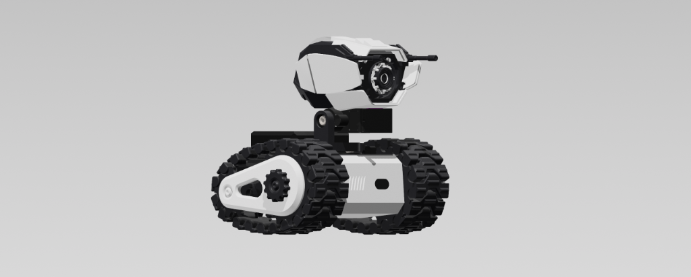
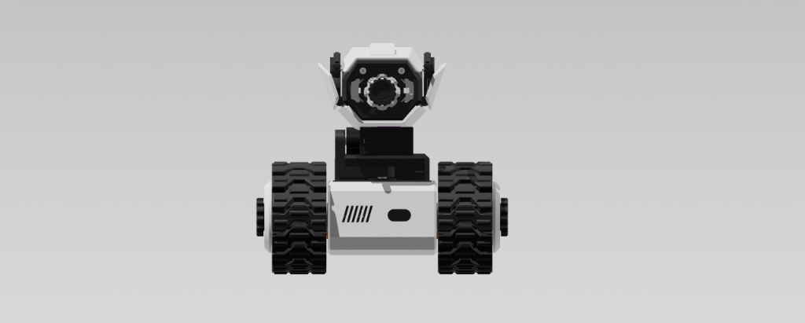
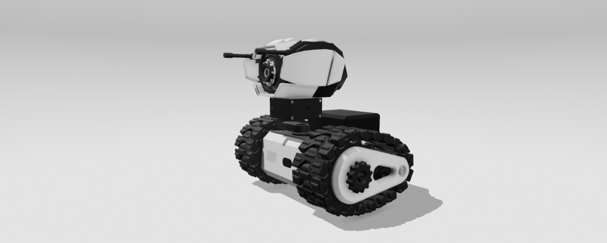
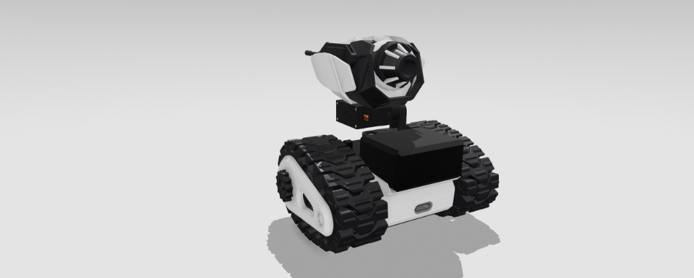

# 🦖 Robot T-Rax - Custom Board & Organic Non-Verbal Droid (R2-D2 Style)

<p align="center">
  
  
</p>
<p align="center">
  
  
</p>

Dự án firmware tùy chỉnh cho **Robot T-Rax** dựa trên nền tảng **XiaoZhi AI Voice Assistant (ESP32-S3)**. 

> ⚠️ **ĐẶC ĐIỂM CỐT LÕI**: T-Rax **KHÔNG PHÁT RA GIỌNG NÓI TIẾNG NGƯỜI**. Robot phản hồi hoàn toàn bằng âm thanh **R2-D2 Chirp/Beep**, kết hợp chuyển động sinh học mượt mà (Cubic Easing), mắt thở WS2812 và cảm biến né va chạm ToF VL53L0X.

---

## 📌 1. Cấu Hình Phần Cứng (Hardware Specs)

* **Vi điều khiển chính**: ESP32-S3 SuperMini (4MB Flash, 2MB PSRAM Quad).
* **Âm thanh I2S**:
  * Micro I2S: **INMP441**
  * Mạch công suất âm thanh: **MAX98357A** (Phát tiếng Bíp/Chirp R2-D2 qua sóng tổng hợp I2S)
* **Cử động chuyển động**:
  * Động cơ Servo 2 trục cổ đầu (Pan/Tilt - Yaw/Pitch).
  * 2 Động cơ giảm tốc DC bánh xích lái qua mạch Driver **DRV8833**.
* **Cảm biến khoảng cách**: **VL53L0X ToF** (I2C Bus).
* **Đèn biểu cảm mắt**: 1 Đèn LED RGB **WS2812**.
* **Màn hình**: Không sử dụng (`NoDisplay`).

---

## 🔌 2. Sơ Đồ Chân Kết Nối GPIO (Pinout Matrix)

| Linh kiện | Chức năng | Chân linh kiện | GPIO ESP32-S3 SuperMini | Ghi chú |
| :--- | :--- | :--- | :--- | :--- |
| **INMP441 (Micro I2S)** | Bit Clock | `SCK` | **`GPIO 4`** | I2S0 Input |
| | Word Select | `WS` | **`GPIO 5`** | I2S0 Input |
| | Data Out | `SD` | **`GPIO 6`** | I2S0 Input |
| **MAX98357A (Loa Amp)** | Bit Clock | `BCLK` | **`GPIO 7`** | I2S1 Output |
| | Left/Right Clock | `LRCK` | **`GPIO 15`** | I2S1 Output |
| | Data In | `DIN` | **`GPIO 16`** | I2S1 Output |
| **VL53L0X (ToF Sensor)** | I2C Data | `SDA` | **`GPIO 8`** | I2C Master Bus |
| | I2C Clock | `SCL` | **`GPIO 9`** | I2C Master Bus |
| **DRV8833 (Bánh xích)** | Động cơ Trái A | `AIN1` | **`GPIO 10`** | PWM Motor Control |
| | Động cơ Trái B | `AIN2` | **`GPIO 11`** | PWM Motor Control |
| | Động cơ Phải A | `BIN1` | **`GPIO 12`** | PWM Motor Control |
| | Động cơ Phải B | `BIN2` | **`GPIO 13`** | PWM Motor Control |
| **2x Servos (Đầu)** | Trục Quay Ngang | `Pan PWM` | **`GPIO 14`** | LEDC PWM (Servo 1) |
| | Trục Gật | `Tilt PWM` | **`GPIO 17`** | LEDC PWM (Servo 2) |
| **WS2812 (Mắt)** | Data Input | `DIN` | **`GPIO 48`** | WS2812 RMT Controller |
| **Nút bấm** | BOOT / Config | `BOOT` | **`GPIO 0`** | Onboard Boot Button |

---

## 🌊 3. Động Lực Học Chuyển Động Sinh Học (Organic Motion Engine)

### 3.1. Thuật toán nội suy phi tuyến (Easing Functions)
Cổ Robot chuyển động mượt mà nhờ 2 thuật toán nội suy:
- **Cubic Ease-In-Out**: Tăng tốc và giảm tốc êm ái cho cử động bình thường.
  $$f(t) = \begin{cases} 4t^3 & \text{nếu } t < 0.5 \\ 1 - \frac{(-2t + 2)^3}{2} & \text{nếu } t \ge 0.5 \end{cases}$$
- **Back Ease-Out**: Nhún vượt mục tiêu $1\text{--}2^\circ$ rồi nhún nhẹ hồi về vị trí (Áp dụng cho giật mình / ngạc nhiên).

### 3.2. Vi chuyển động nhịp thở (Micro-jitter Breathing)
Khi ở chế độ chờ (Idle), đầu Robot tự động dao động vi sóng biên độ nhỏ $0.5^\circ - 1.2^\circ$:
$$\theta_{pan}(t) = 90^\circ + 1.2^\circ \cdot \sin(0.4t) + 0.6^\circ \cdot \cos(0.2t)$$
$$\theta_{tilt}(t) = 90^\circ + 0.8^\circ \cdot \sin(0.3t) + 0.4^\circ \cdot \cos(0.5t)$$

### 3.3. Bộ lọc thông thấp cho động cơ bánh xích (PWM Low-Pass Filter)
Giảm xóc và chống sụt áp tức thì cho driver DRV8833:
$$PWM_{out}(k) = PWM_{out}(k-1) + \alpha \cdot \big(PWM_{target} - PWM_{out}(k-1)\big) \quad (\alpha = 0.15)$$

---

## 🎭 4. Ma Trận 23 Trạng Thái Cảm Xúc & Hành Vi (Phi Ngôn Ngữ R2-D2)

1. **Tò mò** (Cyan Breathing, Pan=120, Tilt=110, Whistle)
2. **Tập trung** (Green Solid, Pan=90, Tilt=100, Beep)
3. **Cảnh báo** (Orange Strobe, Pan=90, Tilt=130, Alert Sweep)
4. **Tức giận** (Red Strobe, Motor Wiggle, Buzz)
5. **Sợ hãi** (Purple Strobe, Motor Backward 30cm, Scream)
6. **Vui vẻ** (Green Breathing, Motor Wiggle, Arpeggio)
7. **Thất vọng** (Dark Blue, Cúi gầm mặt, Sad Slide Down)
8. **Phát hiện mục tiêu** (Yellow Solid, Target Lock Beep)
9. **Bối rối** (Magenta Breathing, Nghiêng cổ 45°, Question Chirp)
10. **Ngạc nhiên** (White Strobe, High Chirp)
11. **Nghi ngờ** (Amber Breathing, Ngó xiên, Low Chirp)
12. **Yêu thương** (Pink Breathing, Loving Purr)
13. **Chiến thắng** (Cyan Strobe, Motor Wiggle, Fanfare)
14. **E ngại** (Light Pink, Quay đi cúi mặt, Whimper)
15. **Chán nản** (Dim Grey, Cúi nghiêng, Sigh)
16. **Kiêu ngạo** (Gold Solid, Vếch mặt lên trời, Proud Tune)
17. **Tìm kiếm** (Blue Strobe, Quét đầu 45-135°, Radar Sweep)
18. **Lỗi hệ thống** (Red Strobe, Glitch Noise)
19. **Sắp hết pin** (Dim Red Breathing, Gục đầu, Low Power Beep)
20. **Đang sạc pin** (Green Breathing, Charging Hum)
21. **Khởi động** (White Breathing, Power Up)
22. **Ngủ** (LED Off, Gục đầu 20°)
23. **IDLE Tự do** (Tự chạy chuỗi cử động ngẫu nhiên 5-12s/lần)

---

## 🚨 5. Tự Động Né Va Chạm (VL53L0X ToF Sensor)

Khi cảm biến VL53L0X phát hiện vật cản $< 15cm$ ($150mm$):
1. **Phản xạ giật mình khẩn cấp**:
   - Động cơ bánh xích tự động lùi lại 400ms.
   - Đầu ngẩng lên cao (`Tilt=140°`).
   - Đèn mắt WS2812 chớp sáng màu Vàng/Trắng (`Strobe`).
   - Phát âm thanh R2-D2 giật mình.
2. **Thời gian Cooldown**: 2 giây chống lặp phản xạ liên tục.

---

## 🛠️ 6. Hướng Dẫn Biên Dịch & Nạp Firmware

### Biên dịch Firmware:
```bash
python3 scripts/build.py t-rax
```

### Nạp vào bo mạch ESP32-S3 SuperMini:
```bash
idf.py -p /dev/ttyUSB0 flash monitor
```
